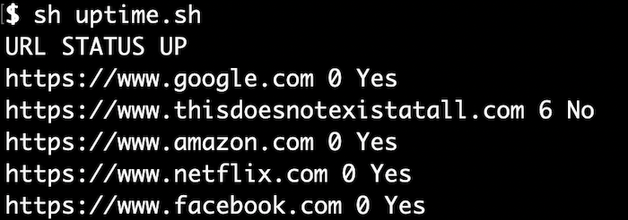

# Uptime



A shell program that reads a list of URL's line by line and checks their connectivity/status with curl. The aim of this tool is to promote network health and awareness with a little customization of the output and reports possible at some point. 

# TODO:

1. Make output of shell script tabular so it can be consumed by other programs more effectively
2. Figure out a way to make two instances of the script talk to each other to get connectivity from two points to compare and reach a combined result.


### Usage (Development)

1. Put your URL's in `urls.txt`;

2. Get results printed to standard output 

`sh uptime.sh` 

### Usage (Master branch)

1. Put your URL's in `urls.txt`;

2. Generate a temporary report:

`sh uptime.sh`

Write report to a new file:

`sh uptime.sh -a`

Write a crude formatted file by success/failure:

`sh uptime.sh -f`

## Progress

Small batch of commits in March - picking it back up in May!

 * Passed initial Shellcheck
 * Tested on a collection of URLs of the world's most visited sites. Most all were up as you would expect.

 Development:

Just a few shellcheck errors to follow up on after paring it down.
 ```
$ shellcheck uptime.sh 
In uptime.sh line 20:
    curl=$(curl -Is --max-time 15 "$line");
    ^--^ SC2034: curl appears unused. Verify use (or export if used externally).
In uptime.sh line 23:
      printf "$line $res No";
             ^-------------^ SC2059: Don't use variables in the printf format string. Use printf '..%s..' "$foo".
In uptime.sh line 26:
      printf "$line $res Yes";
             ^--------------^ SC2059: Don't use variables in the printf format string. Use printf '..%s..' "$foo".
For more information:
  https://www.shellcheck.net/wiki/SC2034 -- curl appears unused. Verify use (...
  https://www.shellcheck.net/wiki/SC2059 -- Don't use variables in the printf...
```


# Goals

* Write results in crude/basic tabular format for consumption by other programs
* Improve reliability and accuracy
